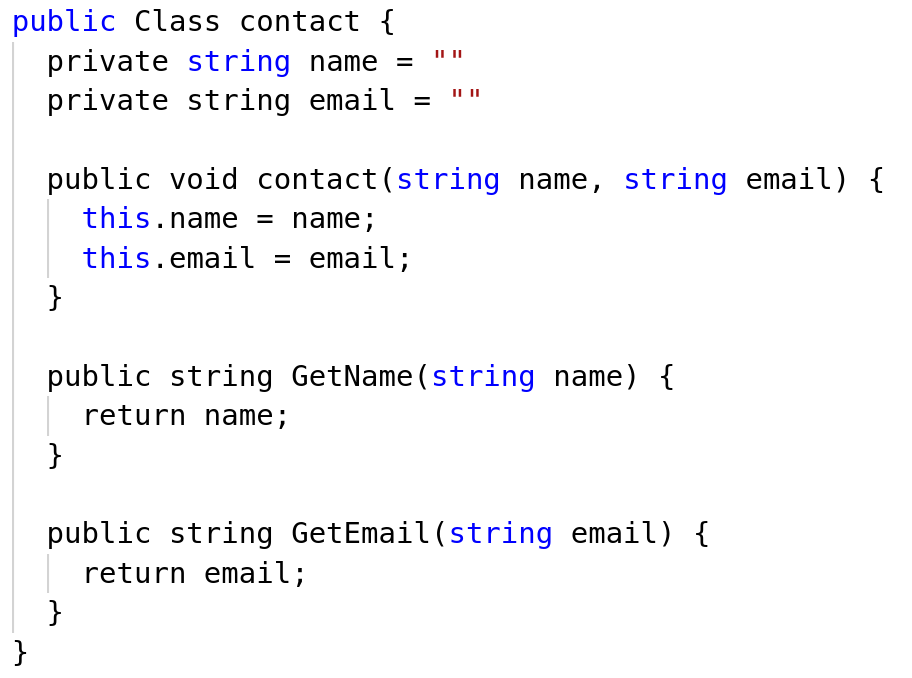
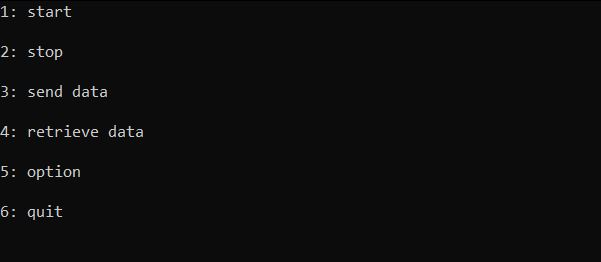
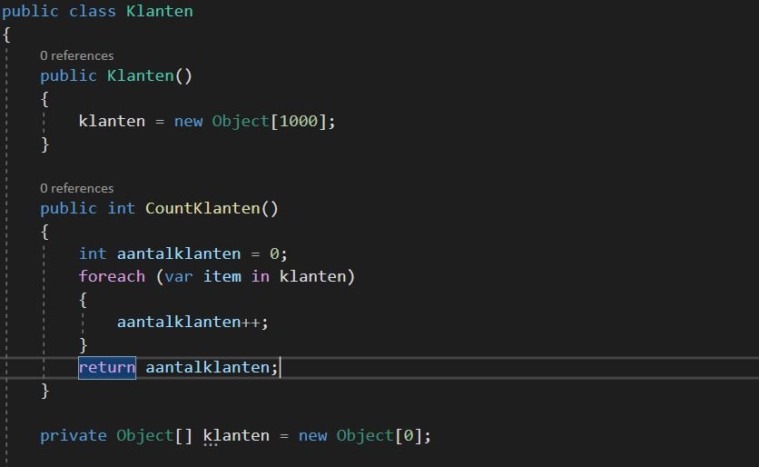

# Assignment OOP Knowledge

Maak 3 scenario's voor het vak object oriented programming. Een scenario is een soort situatie die je schets, waarna je een vraag hierover stelt. Hierbij horen dan tevens een aantal "uitspraken" die de speler dient te beoordelen als correct of niet-correct.

1. Schets de context voor het scenario. Dompel de speler als het ware in de situatie in.
2. Geef de eigenlijke text voor het scenario.
3. Stel een vraag over de text binnen de opgegeven context.
4. Geef hier 3 tot 5 uitspraken/uitdrukkingen die een speler moet beoordelen als waar of onwaar / correct of niet correct. Geef ook telkens aan of deze al dan niet waar/onwaar is.
5. Geef feedback die moet worden getoond op het einde van het scenario. Geef hierbij aan wat wel juist is en waarom. Probeer dit wel te beperken tot de essentie van het scenario. Geef hier ook gerust tips/tricks.
6. Wat is de moeilijkheidsgraad? (makkelijk, normaal, moeilijk). Beoordeel dit op basis van je huidige stand binnen de opleiding.
7. Voeg een passende foto, screenshot, ... toe. Zorg er dan wel voor dat je de afbeelding aan deze repo toevoegt. Indien je een screenshot neemt van code, zorg dan zeker ook dat je code in deze markdown file zit binnen 3 backtics (zoals in voorbeeld).

Verzorg je taal en let op de grammatica. Gebruik ook de juiste nomenclatuur waar van toepassing. Het is de bedoeling dat we deze scenario's kunnen invoeren in het systeem dat voor jullie werd opgezet. Dan kunnen ook jullie alle scenario's doorlopen.

Volg ook tevens de opmaak met markdown zoals in het voorbeeld scenario.

Hieronder vind je een voorbeeld van een scenario. Merk op dat het niet de bedoeling is dat je 3 scenario's maakt over syntax-fouten. Probeer je topics en scenario's divers te maken. Je mag ook gerust voor alle onderdelen meer dan 1 zin hebben. Er kan wat tekst worden voorzien (echter geen roman).

Probeer er ook voor te zorgen dat niet alle uitdrukkingen fout of juist zijn. Zorg dat er wat afwisseling zit.

Je moet niet altijd code voorzien of het moet ook niet expliciet over C# gaan. Maak ook gerust bv. scenario over overerving met een UML diagramma als foto erbij.

## Voorbeeld

1. **Context:** Een vriendin van je is bezig met het modeleren van een class Student voor een persoonlijk project in C#.
2. **Scenario:** Ze heeft de code getest in Visual Studio maar krijgt een hele reeks errors. Je stelt voor om de code eens te bekijken.
3. **Question:** Wat kan je zeggen over de code?
4. **Uitspraken:**
   * Class is een keyword van C# en dient met een kleine letter te worden geschreven. **WAAR**
   * Na de attribuut declaraties dienen statement terminators te worden geplaatst. **WAAR**
   * De getters zijn correct. Die returnen de attributen. **ONWAAR**
   * De naam van de class moet met een hoofdletter. Anders werkt het niet. **ONWAAR**
   * Een constructor zou geen return type mogen hebben in de signatuur van de methode. **WAAR**
5. **Feedback:** Attribuutdeclaraties zijn statements en dienen dus te worden afgesloten met ;. Een constructor heeft geen return type. De getters zouden geen argumenten mogen binnennemen. De classnaam moet niet met een hoofdletter worden geschreven, maar dit is wel een good-practice. Probeer code steeds snel te testen zodat de errors zich niet opstapelen.
6. **Moeilijkheidsgraag:** makkelijk
7. **Foto:**



Code:

```csharp
public Class contact {
  private string name = ""
  private string email = ""

  public void contact(string name, string email) {
    this.name = name;
    this.email = email;
  }

  public string GetName(string name) {
    return name;
  }

  public string GetEmail(string email) {
    return email;
  }
}
```

## Scenario 1

1. **Context:** Je bent een Console app aan het programmeren voor een project.
2. **Scenario:** Als je het programme opstart krijg je een menu. Dit menu bevat meerdere opties
3. **Question:** Welke manier controleer je het best welke optie de user heeft geselecteerd
4. **Uitspraken:**
   * 3 IF ELSE statements **waar**
   * 6 IF statements **onwaar**
   * 1 IF 4 ELSE IF 1 ELSE statements**onwaar**
   * SWITCH statements **waar**
5. **Feedback:**
6. **Moeilijkheidsgraag:** normaal
7. **Foto:**



## Scenario 2

1. **Context:** Je bent een Console app aan het programmeren voor de projectweek die gebruikt maak van een opensource API.
2. **Scenario:** je roept een externe API op gegevens op te halen.
3. **Question:** je hebt een methode ID die een unieke code nodig heeft om te kunnen werken. wat is de beste manier,
                om de varialbe mee te geven aan de methode ID. de UniekeCode wordt nergers anders gebruikt
4. **Uitspraken:**
   * Roep de UniekeCode methode op na de link in de WebRequest **waar**
   * Maak gebruik van een interne class propertie **onwaar**
   * Maak gebruik van een extrene class propertie **onwaar**
   * Maak een variable in de methode ID die UniekeCode oproept en de waarde opslaat **waar**
   * Maak een gloable variable aan die UniekeCode oproept en de waarde opslaat en geef dan de waarde mee **onwaar**
5. **Feedback:** een gloable variable of propertie is hier onnodig en neemt alleen maar ram - geheugen en aangezien het maar 1 keer wordt gebruikt
6. **Moeilijkheidsgraag:** makkelijk

```csharp
public static string ID()
{
  var httpWebRequest = (HttpWebRequest)WebRequest.Create("https://csharp-hacker.bioboost.dev/identity/" + stringUniekeCode);
  string result = "";
  var httpResponse = (HttpWebResponse)httpWebRequest.GetResponse();
  using (var streamReader = new StreamReader(httpResponse.GetResponseStream()))
        {
          result = streamReader.ReadToEnd();
        }
        return result;
}

public static string UniekeCode()
{
  var httpWebRequest = (HttpWebRequest)WebRequest.Create("https://csharp-hacker.bioboost.dev/uniekecode");
  string result = "";
  var httpResponse = (HttpWebResponse)httpWebRequest.GetResponse();
  using (var streamReader = new StreamReader(httpResponse.GetResponseStream()))
        {
          result = streamReader.ReadToEnd();
        }
        return result;
}
```

## Scenario 3

1. **Context:** Je bent een programma aan het ontwerpen voor een lokale winkel.
2. **Scenario:** Je hebt een lijst die gevuld is met namen van klanten
3. **Question:** De eigenaar van de winkel wil zien hoeveel klanten er in het systeem staan opgeslagen.
                 Hoe pak je dit best aan. Kijk naar de foto voor meer context
4. **Uitspraken:**
   * Gebruikt de functie COUNT() op klanten **onwaar**
   * Maak een private propertie waarvan de GET de return klanten.length bevat **waar**
   * Maak een foreach die alle elementen in de array klanten optelt **onwaar**
   * Maak een public propertie waarvan de GET de return klanten.length bevat **waar**
5. **Feedback:** COUNT() werkt nie op klanten en de foreach telt ook alle legen elementen op.
6. **Moeilijkheidsgraag:** normaal
7. **Foto:**



## Student

Geef hier je naam op:

Student: Tristan De Lil
